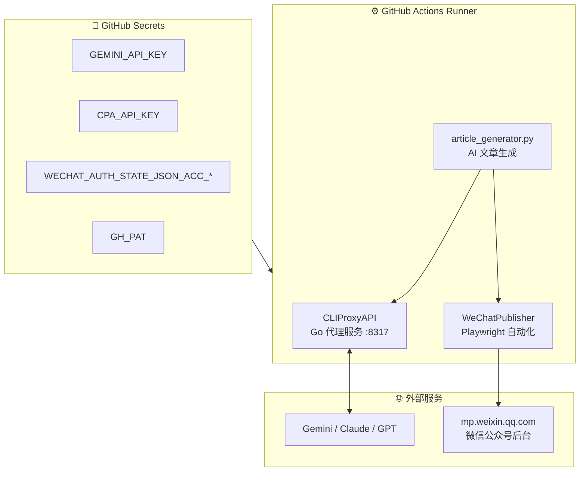

# 🤖 AIstudioProxyAPI + 微信公众号自动化发布矩阵

> 基于 [AIstudioProxyAPI](https://github.com/CJackHwang/AIstudioProxyAPI) 的增强分支：在原有 AI Studio → OpenAI API 代理能力之上，集成了 **AI 自动创作** + **微信公众号全自动发布矩阵**，实现从内容生成到多账号定时发布的完整闭环。

---

## 📌 项目定位

```
┌─────────────────────────────────────────────────────────────────┐
│                        本项目 = 两大能力                         │
│                                                                 │
│  ① AI Studio Proxy API（上游能力）                               │
│     将 Google AI Studio 网页转为 OpenAI 兼容 API                  │
│                                                                 │
│  ② 微信公众号自动化矩阵（本分支扩展）                              │
│     AI 创作文章 → 自动发布 → 多账号并行 → CI/CD 全自动             │
└─────────────────────────────────────────────────────────────────┘
```

---

## 🏗️ 系统架构



---

## 📂 目录结构

```
AIstudioProxyAPI/
│
├── 🔧 上游 Proxy 核心
│   ├── api_utils/              # FastAPI 路由与 API 处理
│   ├── browser_utils/          # Playwright 页面控制
│   ├── stream/                 # 流式代理转发
│   ├── config/                 # 运行时配置 (settings.py)
│   ├── models/                 # 数据模型定义
│   ├── launcher/               # 启动器逻辑
│   ├── server.py               # FastAPI 入口
│   └── launch_camoufox.py      # Camoufox 启动脚本
│
├── 📝 微信公众号发布引擎
│   ├── wechat_publisher/
│   │   ├── browser.py          # 微信浏览器管理 (Camoufox)
│   │   ├── publisher.py        # 核心发布逻辑 (8 阶段流程)
│   │   ├── content_formatter.py # Markdown → 微信 HTML
│   │   ├── selectors.py        # 微信后台 CSS 选择器库
│   │   └── models.py           # 请求/响应数据模型
│   │
│   └── utils/
│       └── image_generator.py  # 文章封面图自动生成 (900×383)
│
├── 🤖 自动化脚本 + AI 创作
│   └── scripts/wechat/
│       ├── publish_batch_scheduled.py # 统一发布引擎 (CSV + AI 自动创作)
│       ├── article_generator.py     # AI 文章生成器 (OpenAI SDK)
│       ├── setup_cliproxy.py        # CLIProxyAPI 服务管理器
│       ├── matrix_auth.py           # 多账号凭证管理 + Secrets 同步
│       └── probe_publish_modal.py   # 发布弹窗探测工具
│
├── 📁 素材目录 (按账号隔离)
│   └── sucai/<账号名>/
│       ├── *.csv                    # 待发布文章 (标题/正文/状态)
│       ├── persona.md               # 账号人设文档 (AI 自动创作依据)
│       └── covers/                  # 封面图
│
├── 🔄 CI/CD 工作流
│   └── .github/workflows/
│       ├── wechat_publish.yml       # 统一发布 (CSV + AI, 手动触发)
│       ├── pr-check.yml             # PR 自动检查
│       ├── release.yml              # 版本发布
│       └── upstream-sync.yml        # 上游同步
│
├── 📦 CLIProxyAPI/             # AI 代理服务 (Go, git clone)
├── sucai/                      # 素材目录 (按账号隔离)
├── pyproject.toml              # Poetry 依赖管理
└── .env.example                # 环境变量模板
```

---

## 🚀 快速开始

### 前置要求

| 组件 | 版本 | 用途 |
|------|------|------|
| Python | ≥3.9 | 运行所有脚本 |
| Poetry | 最新 | 依赖管理 |
| GitHub CLI (`gh`) | 最新 | Secrets 同步 |
| Gemini API Key | 免费 | AI 文章生成 ([获取](https://aistudio.google.com/apikey)) |

### 1️⃣ 安装依赖

```bash
git clone https://github.com/bhrum/zilaisui.git
cd zilaisui
poetry install
poetry run playwright install chromium
```

### 2️⃣ 配置凭证（一键交互式）

```bash
poetry run python scripts/wechat/matrix_auth.py
```

选择菜单：
- **选项 1** → 扫码添加微信公众号（自动提取登录态 → 同步到 GitHub Secrets）
- **选项 2** → 配置 AI 引擎凭证（Gemini API Key + CLIProxyAPI）
- **选项 3** → 全部设置

### 3️⃣ 提供创作主题

```yaml
# sucai/<你的账号名>/topics.yaml
topics:
  - 人工智能如何改变日常生活
  - 深度学习入门：从零到一
  - 2026年最值得关注的科技趋势
```

### 4️⃣ 运行

```bash
# 统一发布（CSV 优先 → AI 自动创作兜底）
poetry run python scripts/wechat/publish_batch_scheduled.py

# 仅测试 AI 文章生成（不发布）
poetry run python scripts/wechat/article_generator.py "你的主题"
```

或通过 **GitHub Actions** 一键触发：`Actions` → `WeChat Publish (CSV + AI)` → `Run workflow`

---

## 🔄 统一发布引擎 — 一个 Action 搞定一切

> `Actions` → **WeChat Publish (CSV + AI)** → `Run workflow`

只有 **一个工作流、一个脚本**，智能切换两种模式：

```
┌─────────────────────────────────────────────┐
│  publish_batch_scheduled.py 统一发布引擎     │
│                                             │
│  1. 扫描 CSV → 有未发布的文章？              │
│     ├── YES → 按批量模式逐篇定时发布          │
│     └── NO  → 检查 persona.md 人设文档        │
│               ├── 有 → AI 生成文章 → 写入 CSV │
│               │       → 按同样节奏发布         │
│               └── 无 → 退出                   │
│                                             │
│  2. 超时 5h → 保存进度 → 触发下一轮接力       │
│  3. persona.md 存在 → 永续循环自动创作        │
└─────────────────────────────────────────────┘
```

### 核心特性

- ✅ **CSV 优先**：有手动写好的文章就先发，绝不浪费人工内容
- ✅ **AI 兜底**：CSV 发完后自动根据 `persona.md` 人设文档创作新文章
- ✅ **统一节奏**：AI 生成的文章写入 CSV，走完全一样的定时发布流水线
- ✅ **永续运行**：只要 `persona.md` 存在，每轮发完自动触发下一轮 AI 创作
- ✅ **多账号矩阵并行**：基于 `wechat_accounts_map.json` 动态生成 Runner 矩阵
- ✅ **断点续传**：CSV 状态列标记已发布文章，接力轮自动跳过

### persona.md — 账号人设文档

每个账号的 `sucai/<账号名>/persona.md` 定义了 AI 的创作规范：

```markdown
---
topics:
  - 人工智能在教育中的应用
  - 量子计算入门指南
batch_size: 5
---

# 公众号人设与创作规范

你是「XXX」公众号的主笔编辑，专注于科技与生活领域...

## 写作风格
- 语气：专业但亲切
- 长度：800-1500 字
...
```

> 📋 完整模板见 `sucai/persona_template.md`

---

## 🔐 GitHub Secrets 一览

| Secret 名称 | 用途 | 必须 |
|---|---|:---:|
| `WECHAT_AUTH_STATE_JSON_ACC_*` | 微信公众号登录态 (每个账号一个) | ✅ |
| `GH_PAT` | GitHub Personal Access Token (工作流接力触发) | ✅ |
| `GEMINI_API_KEY` | Google Gemini API Key (AI 创作) | 🤖 |
| `CPA_API_KEY` | CLIProxyAPI 访问密钥 (自定义) | 🤖 |
| `AI_ARTICLE_TOPICS` | JSON 主题列表 (可选, 优先级最高) | ⚡ |
| `AI_SYSTEM_PROMPT` | 自定义 AI 写作风格提示词 | ⚡ |

> 🤖 = AI 模式专用 &nbsp;&nbsp; ⚡ = 可选增强

---

## 🛡️ 核心设计原则

### 物理隔离矩阵

每个微信公众号完全独立运行，零交叉污染：

```
sucai/
├── 账号A/            ← Runner 1 专属
│   ├── topics.yaml
│   ├── *.csv
│   └── covers/
├── 账号B/            ← Runner 2 专属
│   ├── topics.yaml
│   └── ...
```

### 断点续传 + 5h 超时保护

```
Script Start → 发布文章 → 检查时间 → 超过 5h?
                  ↑                      │
                  │         否 ←─────────┘
                  │         是 → 保存进度 → trigger_next=true
                  │                          ↓
                  └──── GitHub Actions 自动触发下一轮 ──┘
```

### 反检测策略

- **Camoufox** 浏览器（反指纹检测）
- 随机化的鼠标移动与点击延迟
- 人类行为模拟（渐进式输入、自然停顿）
- 每篇文章间插入 3-8 分钟随机等待

---

## ⚡ 常用命令速查

```bash
# ─── 微信自动化 ──────────────────────────────
poetry run python scripts/wechat/matrix_auth.py          # 凭证管理
poetry run python scripts/wechat/publish_batch_scheduled.py   # 统一发布 (CSV + AI)
poetry run python scripts/wechat/article_generator.py "主题"  # 仅测试 AI 生成

# ─── AI Studio Proxy ────────────────────────
poetry run python launch_camoufox.py --debug              # 调试模式 (首次认证)
poetry run python launch_camoufox.py --headless            # 无头模式 (日常)
curl http://127.0.0.1:2048/v1/models                      # 查看模型列表

# ─── 开发工具 ────────────────────────────────
poetry run ruff check .                                    # 代码检查
poetry run pyright                                         # 类型检查
poetry run pytest                                          # 运行测试
```

---

## 🔧 上游 Proxy API 功能

本项目保留了 [AIstudioProxyAPI](https://github.com/CJackHwang/AIstudioProxyAPI) 的全部能力：

- **OpenAI 兼容 API**：`/v1/chat/completions`、`/v1/models`
- **函数调用三模式**：`auto` / `native` / `emulated`
- **认证轮转与 Cookie 刷新**：profile 自动轮转、周期刷新
- **内置 Web UI**：访问 `http://127.0.0.1:2048/` 使用
- **多实例 Docker 管理**：见 `scripts/multi-instance-manager/`

配置详见 [.env.example](.env.example) 和 [docs/](docs/)。

---

## 🗺️ 数据流全景

```
                    ┌──────────────────────────────────────────┐
                    │            GitHub Actions                 │
                    │                                          │
  matrix_auth.py    │   ┌─────────┐   ┌──────────────────┐    │
  (本地扫码) ───────►│   │ Secrets │──►│ setup_cliproxy   │    │
                    │   └─────────┘   │ 下载二进制        │    │
                    │                 │ 生成 config.yaml   │    │
                    │                 └────────┬───────────┘    │
                    │                          │               │
                    │                 ┌────────▼───────────┐    │
                    │                 │ CLIProxyAPI :8317  │    │
                    │                 │ (Go 代理服务)      │◄──►│ Gemini API
                    │                 └────────┬───────────┘    │
                    │                          │               │
                    │                 ┌────────▼───────────┐    │
                    │                 │ article_generator  │    │
  topics.yaml ─────►│                 │ AI 创作文章        │    │
                    │                 └────────┬───────────┘    │
                    │                          │               │
                    │   ┌──────────┐  ┌────────▼───────────┐    │
                    │   │ 封面图   │◄─│ publish_ai_articles│    │
                    │   │ 自动生成 │  │ 端到端流水线       │    │
                    │   └──────────┘  └────────┬───────────┘    │
                    │                          │               │
                    │                 ┌────────▼───────────┐    │
                    │                 │ WeChatPublisher    │    │
                    │                 │ Playwright 自动化  │───►│ 微信公众号
                    │                 └────────────────────┘    │
                    │                                          │
                    │   status.csv ← Git Push ← 状态追踪       │
                    └──────────────────────────────────────────┘
```

---

## 📄 License

[AGPLv3](LICENSE)

## 致谢

- 上游项目：[AIstudioProxyAPI](https://github.com/CJackHwang/AIstudioProxyAPI) by [@CJackHwang](https://github.com/CJackHwang)
- AI 代理：[CLIProxyAPI](https://github.com/router-for-me/CLIProxyAPI)
- 反指纹浏览器：[Camoufox](https://github.com/nichochar/camoufox)
- 自动化框架：[Playwright](https://playwright.dev/)
